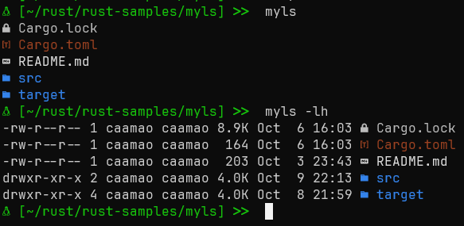

# MyLS

Very basic implementation of ls command on rust. Used to practice rust, the std library and filesystem functions

- Using web-dev-icons to reflect icons and colors based on file name or type
- Will not implement all ls command line parameters, but the ones I find useful



# CleanUps

Checking how much size do some of the external crates pull in

## Initial Point

Current Sizes:


```
 [~/rust/rust-samples/myls]   ls -l target/*/myls
target/debug/myls:
-rwxr-xr-x 2 caamao caamao 17654144 Oct 26 13:15  myls

target/release/myls:
-rwxr-xr-x 2 caamao caamao 1317920 Oct 26 13:18  myls
 [~/rust/rust-samples/myls]   ls -lh target/*/myls
target/debug/myls:
-rwxr-xr-x 2 caamao caamao 16.8M Oct 26 13:15  myls

target/release/myls:
-rwxr-xr-x 2 caamao caamao 1.3M Oct 26 13:18  myls
 [~/rust/rust-samples/myls] 
```

Comilation:
```
 [~/rust/rust-samples/myls]   cargo build
   Compiling proc-macro2 v1.0.86
   Compiling unicode-ident v1.0.13
   Compiling autocfg v1.4.0
   Compiling utf8parse v0.2.2
   Compiling anstyle v1.0.9
   Compiling is_terminal_polyfill v1.70.1
   Compiling anstyle-query v1.1.2
   Compiling libc v0.2.159
   Compiling colorchoice v1.0.3
   Compiling strsim v0.11.1
   Compiling heck v0.5.0
   Compiling clap_lex v0.7.2
   Compiling iana-time-zone v0.1.61
   Compiling log v0.4.22
   Compiling lazy_static v1.5.0
   Compiling colorsys v0.6.7
   Compiling anstyle-parse v0.2.6
   Compiling devicons v0.6.7
   Compiling anstream v0.6.17
   Compiling num-traits v0.2.19
   Compiling clap_builder v4.5.20
   Compiling quote v1.0.37
   Compiling users v0.11.0
   Compiling syn v2.0.79
   Compiling chrono v0.4.38
   Compiling clap_derive v4.5.18
   Compiling clap v4.5.20
   Compiling myls v0.1.0 (/home/caamao/rust/rust-samples/myls)
    Finished `dev` profile [unoptimized + debuginfo] target(s) in 3.45s
 [~/rust/rust-samples/myls] 

```

## After removing users crate

Size:
```
 [~/rust/rust-samples/myls]   ls -l target/*/myls
target/debug/myls:
-rwxr-xr-x 2 caamao caamao 16910800 Oct 26 15:42  myls

target/release/myls:
-rwxr-xr-x 2 caamao caamao 1304336 Oct 26 15:43  myls
 [~/rust/rust-samples/myls] 


 [~/rust/rust-samples/myls]   ls -lh target/*/myls
target/debug/myls:
-rwxr-xr-x 2 caamao caamao 16.1M Oct 26 15:42  myls

target/release/myls:
-rwxr-xr-x 2 caamao caamao 1.2M Oct 26 15:43  myls
 [~/rust/rust-samples/myls] 
```

Clean Build:
```
 [~/rust/rust-samples/myls]   cargo build
   Compiling proc-macro2 v1.0.86
   Compiling unicode-ident v1.0.13
   Compiling utf8parse v0.2.2
   Compiling autocfg v1.4.0
   Compiling colorchoice v1.0.3
   Compiling anstyle v1.0.9
   Compiling anstyle-query v1.1.2
   Compiling is_terminal_polyfill v1.70.1
   Compiling strsim v0.11.1
   Compiling clap_lex v0.7.2
   Compiling heck v0.5.0
   Compiling libc v0.2.159
   Compiling iana-time-zone v0.1.61
   Compiling lazy_static v1.5.0
   Compiling colorsys v0.6.7
   Compiling devicons v0.6.7
   Compiling anstyle-parse v0.2.6
   Compiling anstream v0.6.17
   Compiling num-traits v0.2.19
   Compiling clap_builder v4.5.20
   Compiling quote v1.0.37
   Compiling syn v2.0.79
   Compiling chrono v0.4.38
   Compiling clap_derive v4.5.18
   Compiling clap v4.5.20
   Compiling myls v0.1.0 (/home/caamao/rust/rust-samples/myls)
    Finished `dev` profile [unoptimized + debuginfo] target(s) in 3.55s
 [~/rust/rust-samples/myls] 
```

## Removing colorsys

Build:
```
 [~/rust/rust-samples/myls]   cargo build --release
   Compiling proc-macro2 v1.0.86
   Compiling unicode-ident v1.0.13
   Compiling autocfg v1.4.0
   Compiling utf8parse v0.2.2
   Compiling anstyle-query v1.1.2
   Compiling colorchoice v1.0.3
   Compiling anstyle v1.0.9
   Compiling is_terminal_polyfill v1.70.1
   Compiling libc v0.2.159
   Compiling clap_lex v0.7.2
   Compiling heck v0.5.0
   Compiling strsim v0.11.1
   Compiling iana-time-zone v0.1.61
   Compiling lazy_static v1.5.0
   Compiling devicons v0.6.7
   Compiling anstyle-parse v0.2.6
   Compiling anstream v0.6.17
   Compiling num-traits v0.2.19
   Compiling clap_builder v4.5.20
   Compiling quote v1.0.37
   Compiling syn v2.0.79
   Compiling chrono v0.4.38
   Compiling clap_derive v4.5.18
   Compiling clap v4.5.20
   Compiling myls v0.1.0 (/home/caamao/rust/rust-samples/myls)
    Finished `release` profile [optimized] target(s) in 3.27s
 [~/rust/rust-samples/myls] 
```

Sizes:
```
 [~/rust/rust-samples/myls]   ls -l target/*/myls
target/debug/myls:
-rwxr-xr-x 2 caamao caamao 16450944 Oct 26 16:50  myls

target/release/myls:
-rwxr-xr-x 2 caamao caamao 1298552 Oct 26 16:50  myls
 [~/rust/rust-samples/myls] 
 [~/rust/rust-samples/myls] 
 [~/rust/rust-samples/myls] 
 [~/rust/rust-samples/myls]   ls -lh target/*/myls
target/debug/myls:
-rwxr-xr-x 2 caamao caamao 15.7M Oct 26 16:50  myls

target/release/myls:
-rwxr-xr-x 2 caamao caamao 1.2M Oct 26 16:50  myls
 [~/rust/rust-samples/myls] 
```
